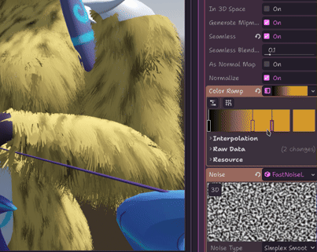
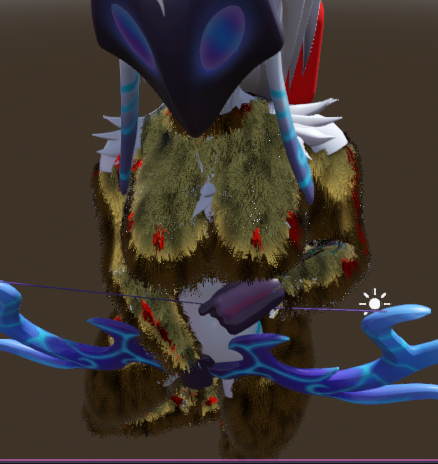

# squiggles-fur
 A Godot 4 addon for stylish shell fur

## Supported Version
**4.2.X, 4.1.X** : no notable issues

**4.0.X** : All features functional, but the addon is unable to mark a scene as unsaved, which means the user ***must remember to manually save the scene before closing*** (in order to prevent losing progress).

As of updating, this means that all currently available Godot **4.X** versions are supported

# Gallery

Fur that physically moves, adjustable to be semi-realistic or very stylized.

Fur that can be textured using all of the same texture resources Godot can handle.

Fur that can be given metalness and roughness values to alter how it behaves under light.

# Additional Features
- Automatic mesh generation
- No code solution

# Licensing

This addon and all of my work is under the MIT license. The "kindred" model used for demonstration purposes is not mine and the author requested this license information to be shared wherever it is used:
> This work is based on "Kindred (League of Legends) - Rigged" (https://sketchfab.com/3d-models/kindred-league-of-legends-rigged-06a32da82b0441c39950296315307400) by maisth (https://sketchfab.com/maisth) licensed under CC-BY-4.0 (http://creativecommons.org/licenses/by/4.0/)

This model is included with modifications.
